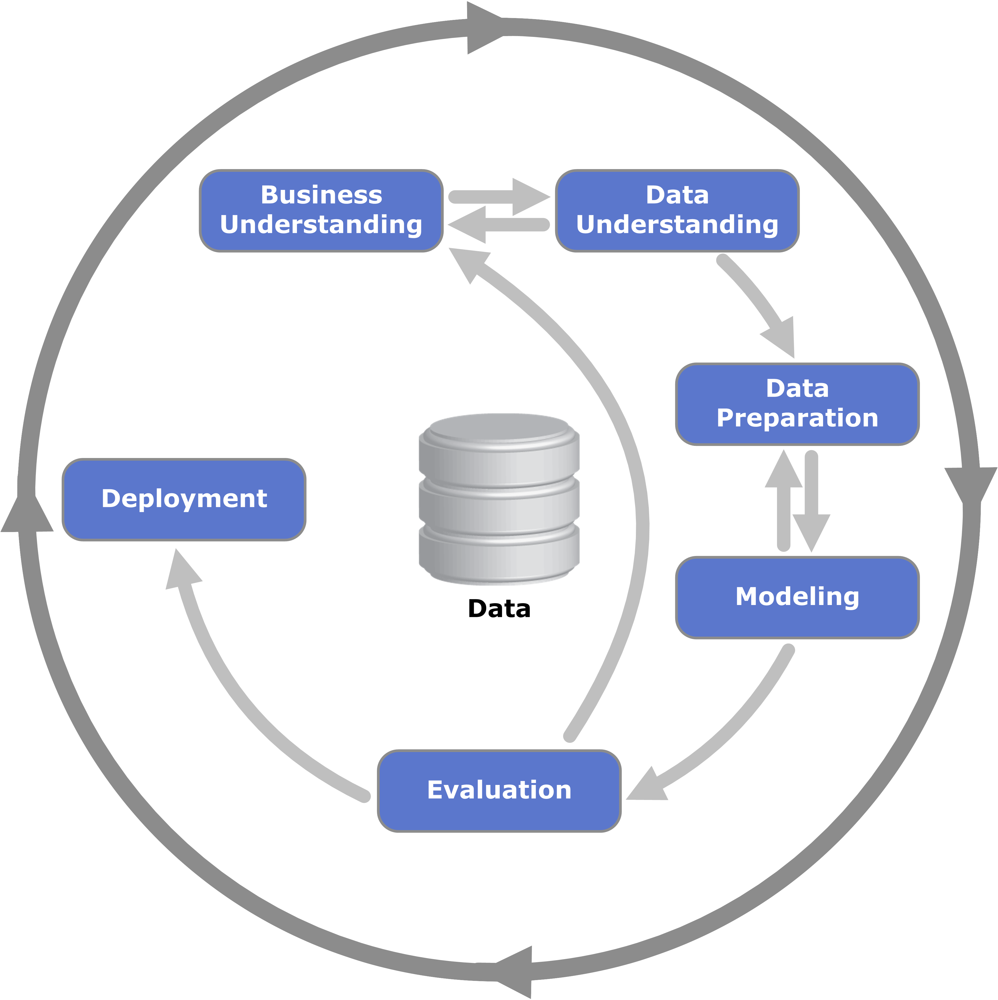
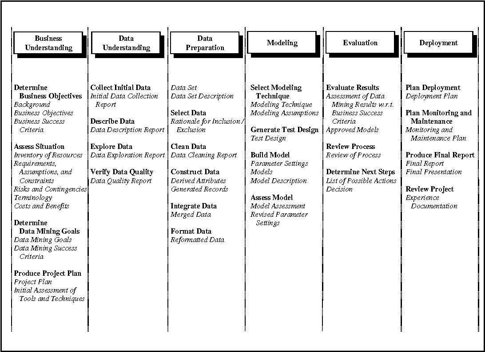

```{r setup, include=FALSE}
knitr::opts_chunk$set(echo = TRUE)
```

# Introdução

A análise da Produção Científica e Acadêmica da Universidade de Brasília é relevante para o entendimento de como a Universidade está gerindo e investindo seus recursos, para as pessoas do meio acadêmico obterem informações que lhe sejam úteis e contribui na divulgação do conhecimento científico através de uma abordagem simplificada do mesmo para as pessoas não inseridas nesse ambiente. Assim, esse trabalho tem como objetivo o uso da disciplina de Ciência dos Dados para analisar, entender e gerar novas informações sobre os dados acadêmicos da Universidade de Brasília.

Esse trabalho terá o enfoque nas áreas de Geografia, Geologia, Geociências Aplicadas e Geodinâmica, devido a gama de áreas existentes na universidade, dessa forma permitindo uma análise mais detalhada e robusta dos dados a serem trabalhos. Para a análise, será utilizado *datasets* referentes aos professores, publicações e orientações dos mesmos, os quais foram disponibilizados na plataforma [E-Lattes](http://elattes.com.br/).

Por fim, ao longo desse trabalho será demonstrado como é realizado um trabalho de Ciência dos Dados, incluindo o conhecimento do contexto dos dados que serão trabalhados, seleção dos dados mais relevantes, limpeza e análise para gerar gráficos e informações de utilidade para aqueles interessados nas produções científicas e acadêmicas, além da possibilidade de obter informações desconhecidas até então. Com isso, esperamos que ao fim desse trabalho o entendimento de como as áreas de Geografia e Geociências em geral da Universidade de Brasília estão trabalhando e pesquisando.


# Metodologia

## Ferramentas e Técnicas

Foi utilizada a linguagem R e plataforma RStudio para a manipulação e análise dos dados, e este documento foi gerado no formato R Markdown. Foram utilizadas as seguintes bibliotecas no RStudio:

```{r library-load}
library(jsonlite)
library(listviewer)
library(readxl)
library(ggplot2)
library(dplyr)
library(tidyr)
library(readr)
library(purrr)
library(tibble)
```

## CRISP-DM

A metodologia aplicada para produção desse relatório é a _Cross Industry Standard Process for Data Mining_ (CRISP-DM). É ideal para Big Data e demais cenários que envolvam processos relacionados à análise de grandes volumes de dados. O CRISP-DM divide o processo de mineração de dados em seis fases principais. A sequência dessas fases não é rigorosa e se move iterativamente entre as fases, como for necessário. Dentro de cada fase no CRISP-DM existe uma estrutura hierárquica de atividades genéricas para serem realizadas, que podem determinar a execução de atividades específicas. As etapas são definidas a seguir:

### Business Understanding: Entendimento do negócio
Etapa em que busca-se uma compreensão adequada do problema que necessita ser resolvido. São definidos
os principais objetivos e expectativas em relação ao trabalho como um todo, e é feita a Avaliação das
Circunstâncias para definir recursos ou dificuldades que podem influenciar o projeto.

### Data Understanding: Compreensão dos dados
Tem o objetivo de inspecionar, organizar e descrever todos os dados disponíveis. Busca-se saber quais dados
podem ser relevantes para decifrar o problema. É nesta etapa em que ocorrem: a Coleta inicial dos dados; a
Descrição dos dados; a Análise exploratória dos dados; a Verificação de sua qualidade.

### Data Preparation: Preparação dos dados
Nesta etapa o profissional deverá realizar a manipulação técnica dos dados, realizando a sua “filtragem” para
torná-los bem definidos, organizados e bem inspecionados. É preciso preparar todas as databases, definir o
formato e os atributos dos dados que serão trabalhados, e ajustar demais questões técnicas. É dividida nas
atividades de: Seleção dos dados; Limpeza dos dados: Construção dos dados, ou seja, a criação de novas
variáveis que auxiliam a análise; Integração dos dados; Formatação dos dados, para facilitar a análise.

### Modeling: Modelagem
São selecionadas e aplicadas as técnicas de mineração de dados mais apropriadas, dependendo dos objetivos
identificados na etapa de entendimento do negócio. É dividida em quatro atividades: Seleção das técnicas de
modelagem; Testes de modelagem; Construção de modelo com base nos testes; Avaliação do modelo.

### Evaluation: Avaliação do modelo
Trata-se do acompanhamento dos resultados objetivos e a avaliação da aplicabilidade confiável das informações
e conhecimentos obtidos. Possui três tarefas: Avaliação dos resultados; Revisão do processo; Determinação
dos etapas seguintes, se será necessário realizar a revisão de passos tomados.

### Deployment: Desenvolvimento
É a aplicação prática de todo o conhecimento que foi obtido por meio do trabalho de mineração e modelagem
a partir das análises dos dados realizadas. O conhecimento obtido deve ser apresentado de forma palpável e
aplicável ao cliente.



_Figura I_

Na _figura I_ as setas mostradas na imagem do processo indicam as dependências mais importantes e ocorrentes entre as fases do processo. O círculo externo no diagrama simboliza a natureza cíclica da própria mineração de dados. Um processo de mineração de dados continua mesmo depois que uma solução foi implementada.


_Figura II_

Na _figura II_ é esboçado as fases acompanhados das tarefas e saídas geradas.

### Como surgiu o CRISP-DM?

O CRISP-DM foi idealizado no ano de 1996 e se tornou um projeto da União Europeia sob a iniciativa de financiamento _European Strategic Program on Research in Information Technology_ (ESPRIT) no ano de 1997. O projeto foi liderado por cinco empresas: SPSS, Teradata, Daimler AG, NCR Corporation e OHRA. O modelo de trabalho nasceu a partir da iniciativa de profissionais que trabalhavam com data mining.


# CRISP-DM Fase 1 - Entendimento do Negócio

## O que é o Sistema Nacional de Pós-Graduação? (Contextualização)

A produção do conhecimento científico, no Brasil, é predominantemente efetuada por meio do Sistema Nacional de Pós-Graduação - SNPG, e mais fortemente relacionada com a formação de doutores nesse sistema (Pátaro e Mezzomo, 2013), por meio de cursos de pós-graduação strictu sensu.

Fernandes e Sampaio (2017) já indicaram que a ciência é reconhecidamente um elemento essencial para o desenvolvimento social e econômico de qualquer nação. Assim sendo, faz-se mister aprimorar o SNPG como forma de promoção desse crescimento, visando maximizar o retorno decorrente do emprego dos recursos nele aplicados. A promoção do crescimento do SNPG se dá predominantemente por meio de avaliações regulares de seus programas de pós-graduação, sob responsabilidade da CAPES, que realiza a cada quatro anos um complexo (Leite, 2018, p. 13) e custoso processo de coleta de dados, análise e deliberação sobre as pós-graduações strictu sensu, em coerência com o estabelecido no Plano Nacional de Pós-Graduação (PNPG) 2012-2020 (CAPES, 2010) e nos diversos documentos que definem os critérios de organização da pós-graduação em cada área do conhecimento (CAPES, 2018). Leite (2018) faz uma apresentação geral de como se organizam e são avaliadas as pós-graduações no Brasil.

O Plano Nacional de Pós-Graduação (PNPG), por outro lado, define diretrizes estratégicas para desenvolvimento da pós-graduação brasileira, que deve abordar prioritariamente grandes temas de interesse nacional, tais como a redução das assimetrias de desenvolvimento entre as regiões do Brasil, a formação de professores para a educação básica, a formação de recursos humanos para as empresas, a resposta aos grandes desafios brasileiros sobre Água, Energia, Transporte, Controle de Fronteiras, Agronegócio, Amazônia, Amazônia Azul (Mar), Saúde, Defesa, Programa Espacial, além de Justiça, Segurança Pública, Criminologia e Desequilíbrio Regional. O PNPG também traça as diretrizes para financiamento da pós-graduação e sua internacionalização, apresentando conclusões e recomendações.

As avaliações do SNPG, ao atribuirem mensurações de desempenho às diversas pós-graduações que dele fazem parte, geram incentivos e penalidades aos programas, tendo em vista a limitada disponibilidade de recursos para investimento em bolsas, taxas de bancada etc. Embora o sistema seja altamente sofisticado ele é também altamente criticado (Azevedo et al., 2016), sobretudo porque há percalços na busca por um equilíbrio entre as diferentes concepções de finalidade da ciência. Se de um lado a promoção do conhecimento gerado predominantemente nas ditas ciências hard constribui para criar fluxos econômicos mais intensos, isso não significa que essa promoção possa ocorrer em detrimento da menor promoção na geração de conhecimento
sobre problemas sociais, predominantemente gerado nas ditas ciências soft, especialmente das áreas de humanidades, sob pena de ampliação de desigualdades (Azevedo et al., 2016).

Não há solução simples, mas postula-se, nesta disciplina, que uma maior agilidade na avaliação e a utilização
de critérios mais objetivos, poderá facilitar a melhoria do sistema.

### Os Colégios, Grandes Áreas e Áreas da Pós-Graduação Brasileira

A partir de 2018, as diversas áreas da pós-graduação brasileira foram organizadas na forma de colégios,
grandes áreas e áreas, conforme apresentam as tabelas a seguir.

#### Colégio de Ciências da vida

CIÊNCIAS AGRÁRIAS| CIÊNCIAS BIOLÓGICAS| CIÊNCIAS DA SAÚDE
-|-|-
Ciência de Alimentos |Biodiversidade |Educação Física
Ciências Agrárias I |Ciências Biológicas I |Enfermagem
Medicina Veterinária |Ciências Biológicas II |Farmácia
Zootecnia / Recursos Pesqueiros |Ciências Biológicas III |Medicina I
-|-|Medicina II
-|-|Medicina III
-|-|Nutrição
-|-|Odontologia
-|-|Saúde Coletiva


#### Colégio de Ciências Exatas, Tecnológicas e Multidisciplinar

CIÊNCIAS EXATAS E DA TERRA|ENGENHARIAS|MULTIDISCIPLINAR
-|-|-
Astronomia / Física |Engenharias I |Biotecnologia
Ciência da Computação |Engenharias II |Ciências Ambientais
Geociências |Engenharias III |Ensino
Matemática / Probabilidade e Estatística |Engenharias IV |Interdisciplinar
Química | - |Materiais


#### Colégio de Humanidades


CIÊNCIAS HUMANAS | CIÊNCIAS SOCIAIS APLICADAS | LINGUÍSTICA, LETRAS E ARTES
-|-|-
Antropol/Arqueol | Admin.Púb./Empr.,C.Contáb. e Tur.|Artes
Ciência Pol. e Rel. Int. |Arquit., Urban. e Design | Linguística e Literatura
Ciências da Religião e Teol. |Comunicação e Informação|-
Educação |Direito|-
Filosofia |Economia|-
Geografia |Planej. Urbano e Reg. / Demografia|-
História |Serviço Social |-
Psicologia|-|-
Sociologia|-|-


## A UnB dentro do Sistema Nacional de Pós-Graduação (Contextualização)

### O que é a UnB?

A Universidade de Brasília (UnB) é uma universidade pública federal brasileira. É a maior instituição de ensino superior do Centro-Oeste do Brasil e uma das mais importantes do país.

_"Resultado do sonho e do trabalho de educadores como Darcy Ribeiro e Anísio Teixeira, a UnB é, desde 1962, ano de sua criação, uma das principais referências acadêmicas nacionais. A diversidade cultural presente em seus quatro campi é uma de suas características marcantes. A pluralidade, aliada à busca permanente por soluções inovadoras, move a produção científica e o cotidiano da instituição. A UnB segue atuante em todas as áreas do conhecimento, aberta às principais demandas do Brasil e do mundo."_ (www.unb.br/a-unb)


### Geografia

A Geografia tem como objeto de estudo a superfície terrestre e seus fenômenos, bem como a relação humana com essa superfície. Dessa maneira, o geógrafo analisa a relação da população com a região que ocupa e os efeitos dessa ocupação. O Geógrafo pode seguir duas áreas com focos diferentes: a carreira acadêmica, como professores e pesquisadores; ou, uma carreira profissional, ligada a indústria.

O Programa de Pós-graduação em Geografia(PPGGEA) da Universidade de Brasília(UnB) foi criado em 1996 já com o curso de mestrado, e a partir de 2011
inicio o curso de Doutorado.

De acordo com o programa, seu principal central é o desenvolvimento de inovações
científicas na área do conhecimento da Geografia e na formação de docentes,
pesquisadores e recursos humanos especializados.
O portal do programa pode ser acessado pela URL http://www.posgea.unb.br/.

O PPGGEA conta com diversos laboratórios nas subáreas de Geografia. São esses:

* Centro de Cartografia Aplicada e Informação Geográfica (CIGA):
Conta estrutura física organizada com equipamentos básicos para o desenvolvimento de atividades direcionadas ao manuseio de ferramentas geográficas voltadas para a educação geográfica e o planejamento e gestão do território.

* Centro de Documentação Geográfica – Milton Santos (CDG):
Espaço é destinado para os alunos de pós-graduação do GEA.

* Laboratório de Cartografia e Fotointerpretação:
Laboratório equipado com mapoteca, fotografias aéreas em diversas escalas, retroprojetor, estereoscópicos de bolso e de espelho e mesas para trabalhos cartográficos. Consta ainda de um acervo de cartas sistemáticas de suporte aos projetos desenvolvidos no GEA por professores e estudantes (Graduação e Pós-Graduação)

* Laboratório de Geografia Física(LAGEF):
LAGEF desenvolve pesquisas em Geomorfologia, pedologia, educação ambiental, ensino de Geografia, biogeografia e gestão ambiental. Apóia atividades de pesquisa com a participação dos alunos de graduação de pós-graduação. O laboratório abriga os projetos de pesquisa desenvolvidos pelos alunos do PIBIC/ Cnpq (Programa Institucional de Bolsas de Iniciação Científica/ DPP/UnB).

* Laboratório de Geoiconografia e Multimídias (LAGIM):
Um dos focos prioritários do LAGIM é o de aproximar-se dos demais laboratórios e lhes propor ações conjuntas.

* Laboratório de Sistemas de Informações Espaciais (LSIE):
O LSIE é um espaço programado para desenvolver atividades de pesquisa com alunos da Graduação e Pós-Graduação do Departamento de Geografia, assim como outros departamentos de áreas afins da Universidade. O LSIE desenvolve atividades de pesquisa e extensão no campo da geomática, com o propósito de integrar, adquirir e gerenciar dados e/ou informações espaciais. O laboratório trabalha em projetos com os diferentes órgãos e instituições que visam o desenvolvimento sustentado do meio ambiente.

* Laboratório de Análises Territoriais (LATER):
Os principais objetivos do LATER são os seguintes: Organizar grupos de pesquisa temáticos para potencializar esforços e estreitar os laços entre docentes, alunos e participantes diversos; Fortalecer um espaço para debates em interação com a graduação; Organizar os projetos em grupos para discussões, trabalhos, pesquisas e orientações e torná-los mais produtivos. Os trabalhos desenvolvidos no laboratório congregam alunos de graduação, pós-graduação e professores, proporcionando suporte teórico e metodológico para a elaboração dos trabalhos científicos no âmbito territorial, cujos produtos foram publicações em revistas, seminários e eventos de vários tipos.

* Laboratório de Climatologia Geográfica (LCGea):
O objetivo deste laboratório é ampliar e difundir os conhecimentos teóricos e práticos da Climatologia Geográfica Brasileira; ampliar os estudos de clima do Distrito Federal; estreitar laços com a sociedade civil e ampliar as relações profissionais visando a solução de problemas da comunidade; e- fornecer subsídios técnicos para o planejamento e a gestão do território.

* Laboratório de Geografia, Ambiente e Saúde (LAGAS):
O LAGAS tem como objetivo principal proporcionar um espaço para discussões e apoio para elaboração e desenvolvimento de projetos de pesquisa e extensão que englobam uma abordagem integrada entre a análise geográfica das questões de saúde, meio ambiente e novas metodologias baseadas em geotecnologias, a fim de ampliar o conhecimento científico sobre esses temas e apoiar a formação de profissionais nessa área.

Segundo dados do portal do PPGGEA, constam 359 registros de teses e dissertações vinculados a esse programa de pós graduação.

### Geociências Aplicadas e Geodinâmica

O Curso de Pós-graduação em GEOCIÊNCIAS APLICADAS, criado em 2008, tem como objetivo principal impulsionar o ensino e a pesquisa das geotecnologias que nas últimas décadas consagraram-se como ferramentas de coleta, organização, análise e processamento de dados e de informações nas diferentes aéreas das ciências da terra, a fim de demonstrar e desenvolver o potencial de suas aplicações às práticas e ao conhecimento geocientífico. O uso das geotecnologias na abordagem da informação geoespacial ou geográfica foi o processo que viabilizou a integração de um maior número de elementos e dados de diferentes origens, possibilitando maior materialidade na compreensão das relações entre o espaço geográfico e os componentes e constituintes terrestres.
O Curso de Pós-graduação em GEOCIÊNCIAS APLICADAS oferece titulação nos níveis de Mestrado e Doutorado. O Curso está estruturado em 3 (três) áreas de concentração:

* Geofísica Aplicada
* Geoprocessamento e Análise Ambiental
* Hidrogeologia e Meio Ambiente

A duração do curso de mestrado é de no mínimo 2 e no máximo 4 semestres letivos, enquanto o de doutorado abrange o mínimo de 4 e o máximo de 8 semestres regulares.

### Geologia

O Programa de Geologia da UnB - Universidade de Brasília é vinculado ao Instituto de Geociências da UnB (IG).

O IG ocupa área de mais de 6.550 m 2 no prédio do Instituto Central de Ciências (ICC). O IG possui ainda dois prédios próprios, onde estão instalados o Observatório Sismológico e o Laboratório de Geocronologia, com área adicional de 2.500 m 2 . No ICC funcionam a Direção e Secretaria, salas de aula, laboratórios, salas individuais de professores, salas para alunos de pós-graduação, o Museu de Geociências, os Centros Acadêmicos de Geologia Jorge Gushiken (CAGEO) e de Geofísica (CAGEF) e o Grupo Espeleológico da Geologia (GREGEO).

IG apresenta caráter multidisciplinar e procura integrar seus pesquisadores em trabalho de equipe, em torno de um objetivo comum, que é o de realizar pesquisa de alto nível e formar recursos humanos de qualidade.

O Instituto de Geociências da UnB conta com laboratórios em todas as subáreas das Geociências, aos quais os estudantes têm amplo acesso. Quase todos os laboratórios possuem equipamentos de última geração, a fim de atenderem adequadamente às atividades de ensino e pesquisa desenvolvidas no âmbito do Instituto, bem como ao intercâmbio com outras universidades, instituições de pesquisa e empresas do País e do exterior. Encontram-se em pleno funcionamento os laboratórios de laminação, preparação de amostras, separação de minerais pesados, computação, microscopia, inclusões fluidas, difratometria de raios X, microssonda eletrônica, geoquímica, isótopos estáveis, geocronologia, micropaleontologia, microscopia eletrônica de varredura, sensoriamento remoto e análise espacial, geofísica aplicada, laboratórios do Observatório Sismológico e de estudos da litosfera. O Laboratório de Geocronologia, por exemplo, possui excelente estrutura para análises geocronológicos e de geoquímica isotópica, que têm sido realizadas para a comunidade científica nacional e internacional, além de empresas públicas e privadas. Veículos apropriados para trabalhos de campo estão à disposição dos estudantes e professores.

Em decorrência da qualificação e dedicação de seu corpo docente, de seus técnicos e de seus estudantes e da qualidade de sua infraestrutura, todos os cursos oferecidos pelo Instituto de Geociências são bem avaliados pelo MEC e outros institutos de avaliação:

* Programa de Pós-Graduação em Geologia - 6;
* Programa de Pós-Graduação em Geociências Aplicadas - 4;
* Curso de Graduação em Geologia - 5;
* Curso de Graduação em Geofísica - 4;
* Curso de Graduação em Ciências Ambientais - 4.

O Museu de Geociências é um dos principais museus da UnB. Possui acervo expressivo e diversificado, que atende à visitação diária da comunidade da UnB, de grupos de estudantes do ensino fundamental e médio e da sociedade em geral.

O Observatório Sismológico (SIS) é um Centro do Instituto de Geociências (IG) da Universidade de Brasília (UnB). Suas responsabilidades envolvem três áreas, que são: o ensino (níveis de graduação e pós-graduação), a Extensão e a Pesquisa relacionada à sismicidade e à estrutura do interior da Terra. Sua principal atividade é o monitoramento sismográfico da sismicidade brasileira, natural e induzida por reservatórios. Dispõe de sede própria com boa infraestrutura física (laboratórios de Análise de Dados e de Computação; Oficina Eletrônica, Mostra de Sismologia, Biblioteca, entre outros), instrumental (sistemas sismográficos digitais completos, analisadores de espectro, gravímetro, geradores e medidores de rádio-freqüências, geradores de função, GPS’s etc.), computacional (uma rede local com seis estações de trabalho, PC’s e periféricos), e recursos humanos (professores, técnicos-administrativos, prestadores de serviços e alunos bolsistas de
graduação e pós-graduação).

### Outros aspectos que caracterizam a produção científica e acadêmica da UnB


## O que a Organização precisa realmente alcançar?

Vários stakeholders estão envolvidos neste projeto, e poderíamos considerar cada um deles como distintas organizações que possuem interesses distintos e complementares. Elas são:

* A Disciplina Ciência de Dados para Todos 2018.1, que quer comprovar que seus alunos dominam ferramentas e técnicas de ciência de dados, para fins de avaliação de rendimento da disciplina.
* A UnB, representada pelos decanatos de pós-graduação (DPG) e de pesquisa e inovação (DPI), que querem dispor de instrumentos para realização de avaliações contínuas de suas pós-graduações.
* O SNPG, que assim com o DPG e DPI, também pode se beneficiar do uso de instrumentos para realização de avaliações contínuas de suas pós-graduações.
* Os interessados em melhor conhecer o que é produzido pelo Sistema Nacional de Pós-graduação, como empresas privadas, que querem desfrutar dos benefícios gerados pela  ciência brasileira.

A fim de dar maior fidelidade e homogeneidade ao exercício realizado na disciplina, focaremos em atendimento aos interesses comuns das organizações DPI, DPG e CAPES, que desejam dispor de instrumentos ágeis para avaliação contínua da pós-graduação brasileira. 

Com base no exposto, o objetivo do trabalho final a ser alcançado pelos produtos de mineração de dados desenvolvido pelos alunos da disciplina Ciência de Dados para Todos é produzir, tomando por base inicial os dados fornecidos pelos professores responsáveis pela disciplina, ferramentas para análise e avaliação contínuas e de baixo custo, do desempenho de um conjunto de pós-graduações que estão vinculadas a uma mesma subárea ou grupo de conhecimento. Cada área de pós-graduação apresenta suas características peculiares, assim como cada um dos programas vinculados a essas áreas.
Como já informado, características peculiares de cada programa podem ser obtidas a partir de visita ao sítio da CAPES (2018).

## Avaliação das Circunstâncias

Este trabalho irá demonstrar conhecimentos de Ciência de Dados aplicados aos datasets com informações dos cursos das áreas de Geografia, Geologia, e Geociências, de acordo com o que foi definido pela disciplina e seus professores.

### Avaliação preliminar das pós-graduações na UnB

#### Geografia

Esse programa histórico do programa, tem atualmente 26 integrantes
participantes no corpo docente. O corpo discente, que divido em mestrado e doutorado tem, respectivamente, 70 e 126 integrantes.

Esse programa é formado por uma área de concentração: Gestão Ambiental e
territorial e duas linhas de pesquisa reestruturadas da seguinte forma:

1. Produção do Espaço e Território Nacional
2. Representação Espacial da Dinâmica Territorial e Ambiental

As linhas de pesquisa do programa estão de acordo com a formação acadêmica do
corpo docente e visam atender aos objetivos estipulados, abrigando alunos que
possuem interesse na qualificação em Geografia e outras áreas relacionadas como
Arquitetura e Urbanismo, Sociologia, Planejamento Urbano e Regional, Ecologia,
Geoprocessamento, Ensino de Geografia, entre outras.

As linhas desse programa pesquisa contemplam objetivos dos projetos desenvolvidos e professores e também os interesses de qualificação profissional dos discentes. De acordo com o portal, a proposta do curso possui como elemento estruturador fundamental os projetos de pesquisa que se articulam diretamente com a temática das disciplinas oferecidas e com os projetos de dissertação desenvolvidos pelos alunos. Isso permite que grupos de professores articulados por uma temática participem de projetos comuns, juntamente com seus grupos de orientandos, reunidos nos laboratórios.


#### Geociências Aplicadas e Geodinâmica

O programa de Geociências Aplicadas e Geodinâmica tem atualmente 11 pessoas em seu corpo docente, tendo iniciado em 2008. É dividido em 3 áreas de aplicação:

* Geofísica Aplicada
* Geoprocessamento e Análise Ambiental
* Hidrogeologia e Meio Ambiente

Tem um total de 28 Teses de Doutorado já publicadas e avaliadas, sendo a primeira datada de 30 de julho de 2012 e a mais recente de 8 de maio de 2017. Já as dissertações de Mestrado tem um total de 101 publicadas e avaliadas, iniciando em março de 2010 e indo até 18 de abril de 2017. Essas teses e dissertações são em diversas áreas dentro das 3 áreas de concentração do programa.

#### Geologia

O Programa de Geologia da UnB iniciou no ano de 2012, com 18 linhas de pesquisa, e atualmente possui sete áreas de concentração:

* Bioestratigrafia e Paleoecologia;
* Geofísica Aplicada;
* Geologia Regional;
* Geoquímica;
* Mineralogia e Petrologia;
* Processamento de Dados em Geologia e Análise Ambiental;
* Prospecção e Geologia Econômica.

De acordo com a Avaliação Trienal do programa, o corpo docente do Programa é bem qualificado, mesclando docentes experientes com mais de 10 anos de titulação máxima e jovens doutores com formação diversificada em vários centros nacionais e internacionais, o que permite cobrir com qualidade todas as áreas de pesquisa e formação em desenvolvimento.

O corpo discente que participa do Programa atinge, em média, 104 alunos por ano durante o triênio, sendo em sua maioria estudantes de mestrado. As teses e dissertações possuem qualidade inequívoca, o que é atestado pela publicação de seus resultados em periódicos de ampla circulação, inclusive em periódicos internacionais de nível elevado.

O Programa de Geologia da UnB é dos mais tradicionais e qualificados da área, constituindo um pólo de conhecimentos com forte inserção regional e nacional. A infra-estrutura analítica, em particular o Laboratório de Geologia Isotópica e o Laboratório de Microssonda Eletrônica vem servindo a várias instituições e centros de pesquisa nacionais. Vários docentes são colaboradores em outros programas da área, entre outros UFMT e UFC, atuando em cooperações do tipo Procad e Casadinho. Adicionalmente, o Programa coordena um projeto Pronex e um projeto MCT/CNPq/Instituto Nacional de Ciência e Tecnologia.


### Avaliação preliminar da produção científica e acadêmica da UnB


# CRISP-DM Fase 2 - Entendimento dos Dados

## CRISP-DM Fase.Atividade 2.1 - Coleta inicial dos dados

Todos os arquivos com dados iniciais a seguir apresentados foram fornecidos pelos professores responsáveis pela disciplina. Os dados foram gerados no mês de maio de 2018, e compilam informações entre os anos de 2010 e 2017. Os arquivos estão no formato JSON, e seus atributos iniciais e conteúdos são apresentados a seguir.


### Perfil profissional dos docentes vinculados às pós-graduações
```{r}
json.geografia.perfil <- 'data/Geografia.profile.json'
file.info(json.geografia.perfil)
```

O arquivo `r json.geografia.perfil` apresenta dados sobre o perfil de todos os docentes vinculados a programas de pós-graduação de Geografia da UnB, entre 2010 e 2017.

### Orientações de mestrado e doutorado realizadas pelos docentes vinculados às pós-graduações

```{r}
json.geografia.advise <- "data/Geografia.advise.json"
file.info(json.geografia.advise)
```

O arquivo `r json.geografia.advise` apresenta dados sobre o orientações de mestrado e doutorado feitas por todos os docentes vinculados a programas de pós-graduação de Geografia da UnB, entre 2010 e 2017.

### Produção bibliográfica gerada pelos docentes vinculados às pós-graduações

```{r}
json.geografia.producao.bibliografica <- "data/Geografia.publication.json"
file.info(json.geografia.producao.bibliografica) 
```

O arquivo `r json.geografia.producao.bibliografica` apresenta dados sobre a produção bibliográfica gerada por todos os docentes vinculados a programas de pós-graduação de Geografia da UnB, entre 2010 e 2017. 

### Agrupamento dos docentes conforme áreas de atuação

```{r}
json.geografia.researchers_by_area <- "data/Geografia.researchers_by_area.json" 
file.info(json.geografia.researchers_by_area)
```

O arquivo `r json.geografia.researchers_by_area` apresenta as vinculações de todos os docentes de Geografia que declararam atuar em cada uma das áreas de pós-graduação do Sistema Nacional de Pós-Graduação da CAPES, conforme apresenta-se registrada essa informação no currículo Lattes de cada um, em data recente

### Redes de colaboração entre docentes
```{r}
file.info('data/Geografia.graph.json')
```

O arquivo `rdata/Geografia.graph.json` apresenta redes de colaboração na co-autoria de artigos cientpificos, feitas entre os docentes vinculados a programas de pós-graduação de Geografia da UnB, entre 2010 e 2017.

## CRISP-DM Fase.Atividade 2.2 - Descrição dos Dados


### Descrição dos dados do perfil


#### Potencial de utilização dos dados do perfil dos docentes


### Descrição dos dados de orientações


### Descrição dos dados de produção bibliográfica


### Descrição dos dados de agregação de docentes por área


### Descrição dos dados de redes de colaboração


## CRISP-DM Fase.Atividade 2.3 - Análise exploratória dos dados


### Arquivo Profile

### Arquivo Publicação

### Arquivo Orientação


## CRISP-DM Fase.Atividade 2.4 - Verificação da qualidade dos dados. 


# CRISP-DM Fase 3 - __Preparação dos Dados__


## CRISP-DM Fase.Atividade 3.1 - Seleção dos dados. 


## CRISP-DM Fase.Atividade 3.2 - Limpeza dos dados

## CRISP-DM Fase.Atividade 3.3 - Construção dos dados


## CRISP-DM Fase.Atividade 3.4 - Integração dos dados


## CRISP-DM Fase.Atividade 3.5 -  Formatação dos dados


# CRISP-DM Fase 4 - __Modelagem__


## CRISP-DM Fase.Atividade 4.1 - Seleção das técnicas de modelagem

## CRISP-DM Fase.Atividade 4.2 -  Realização de testes de modelagem


## CRISP-DM Fase.Atividade 4.3 -  Construção do modelo definitivo


## CRISP-DM Fase.Atividade 4.4 - Avaliação do modelo

# CRISP-DM Fase 5 - __Avaliação__


## CRISP-DM Fase.Atividade 5.1 - Avaliação dos resultados

## CRISP-DM Fase.Atividade 5.2 - Revisão do processo


## CRISP-DM Fase.Atividade 5.3 -  Determinação dos etapas seguintes


# CRISP-DM Fase 6 - __Implantação__ (_deployment_)

## CRISP-DM Fase.Atividade 6.1 -  Planejamento da transição 


## CRISP-DM Fase.Atividade 6.2 -  Planejamento do monitoramento dos produtos 


## CRISP-DM Fase.Atividade 6.3 -  Planejamento de manutenção


## CRISP-DM Fase.Atividade 6.4 -  Produção do relatório final


## CRISP-DM Fase.Atividade 6.5 -  Apresentação do relatório final


## CRISP-DM Fase.Atividade 6.6 -  Revisão sobre a execução do projeto


# Referências

* Fernandes, Jorge H C, Ricardo Barros Sampaio, e João Ribas de Moura. "Ciência de Dados para Todos (Data Science   For All) - 2018.1 - Análise da Produção Científica e Acadêmica da Universidade de Brasília - Modelo de Relatório Final da Disciplina - Departamento de Ciência da Computação da UnB". Disciplina 116297 - Tópicos Avançados em Computadores, turma D, do semestre 2018.1, do Departamento de Ciência da Computação do Instituto de Ciências Exatas da Universidade de Brasília, 13 de junho de 2018.

* POSGEA. Apresentação, 2018. Disponíıvel em <http://www.posgea.unb.br/site/apresentacao>.

* IGD. Geociências Aplicadas - Instituto de Geociências - Universidade de Brasília, 2018. Disponíıvel em <http://www.igd.unb.br/index.php?option=com_content&view=article&id=23&Itemid=136>.

